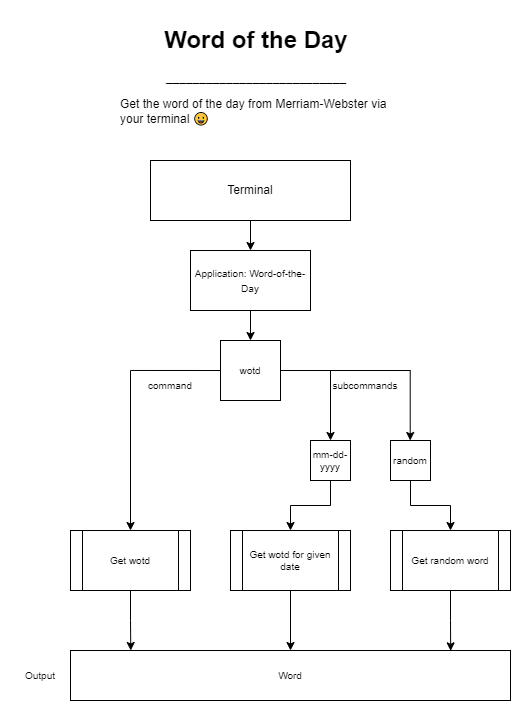

# **Go CLI: Word of the Day - Design Document**

<!--- Create a table of functional and non-functional requirements -->
<!--- Provide descriptions -->
<!--- Resource list-->
## **Functional Requirements:**

- Fetch the word of the day
- Fetch an exact word of the day since 10-10-2006
- Generate a random word of the day

## **Non-functional Requirements:**

- Fetch definition/entry
- Provide a clickable URL for the wotd
- Cache fetched words into a JSON file
- Speed
- Color


## **Diagram:**


## **Dictionary of Choice:**
- [**Merriam-Webster**](https://www.merriam-webster.com)


## **Notes**:

- With the following URL: https://www.merriam-webster.com/word-of-the-day/

- One can append `ANY` date from 2006-10-10 `(YYYY-MM-DD)` to now.


*Example:*

```
https://www.merriam-webster.com/word-of-the-day/2006-10-10

...
Word of the Day : October 10, 2006
Recusant
adjective | REK-yuh-zunt
What It Means
: refusing to submit to authority
...
```

